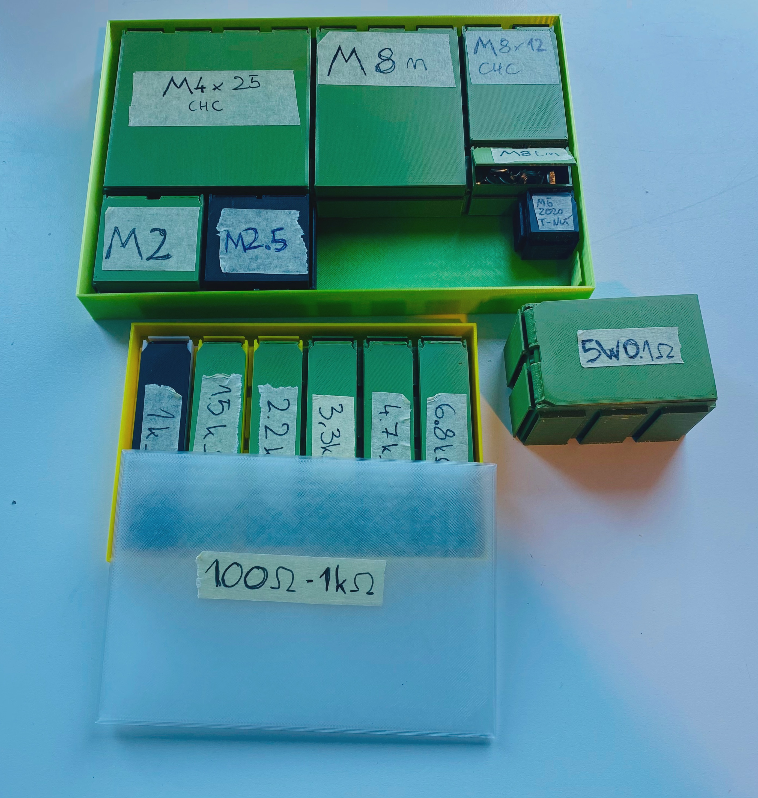

# Composable Organizer
Composable Organizer is a organizer system made up of compartments of various sizes
that can be joined together, as well as lids and trays.

The unit of sizing is one `u`, `1 u == 20 mm`.
The size of a container is identified by 3 numbers, each describing an axis.
For example `2 x 3 x 1` specifies a compartment of 40 mm x 60 mm x 20 mm outer size.




Wall thickness is 1.2 mm by default. It's adjustable, but containers of varying
wall thickness can't interface with each other.

## Build manual

### Quick build
To quickly print these out, head on over to [TBD printables.com link] (). The 
model contains compartment and lid STLs rendered for all variations of sizes
from 1u - 12u.

### Print settings
* **Material**: Any material. I used Prusament PLA.
* **Brim**: Do use brim for the compartments. The inserts can sometimes fall-over
  when thin walls (as by default) are used.
* **Layer height**: At most 0.2 mm layer height (recommend using [variable layer height](https://help.prusa3d.com/article/variable-layer-height-function_1750)
  with adaptive layer height, which will use different layer height for the
  base and the hinges).
* **Infill**: 15% (unless you customize wall thickness, most of the infill will be
  located inside the bottom wall).
* **Perimeters**: 3

### Building from source
If there's a particular size you need that isn't covered by the available STLs,
or you'd simply prefer to build the STLs from source, you can use OpenSCAD
and scripting inside this repository to do so:

```
git clone https://github.com/mmalecki/composable-organizer
cd composable-organizer
./scripts/build <size> # size in the format of `<x>x<y>x<z>`, e.g. `2x3x1`
# `output` directory will contain the built files.
```

(Note: the build script requires GNU Parallel.)

#### Customizing
The `parameters.scad` file contains several knobs you can tweak to get a more
custom system (e.g. with thicker walls).
